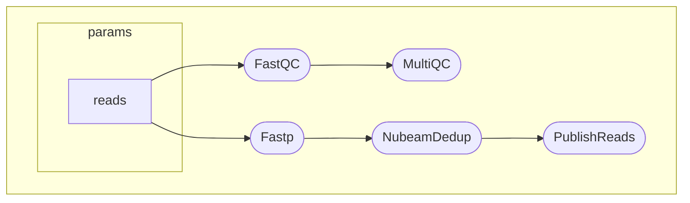

# próbki do CRESIL

https://www.ncbi.nlm.nih.gov/sra/?term=SRR33151019
SRX28412270: eccDNA of human dermal fibroblasts:donor2
OXFORD_NANOPORE (MinION) run: 7,194 spots, 49.9M bases, 42.3Mb downloads

SRR33151018
SRR33151019
SRR33151020

# Inne programy

1. krótkie odczyty
    1. ecc_pipe
    2. circle_finder
    3. circle_map
2. długie odczyty
    1. cresil
    2. FLED
